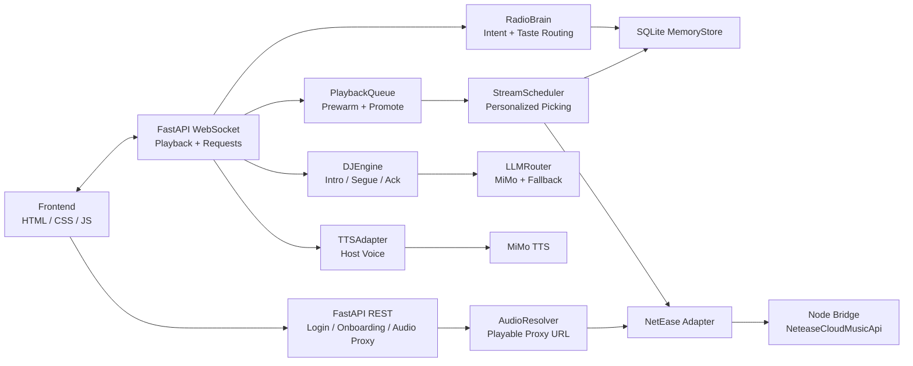

<div align="center">

# FREQME

### 你的私人 AI 电台，听懂你说不清的那一部分。

FREQME is a private AI radio that learns your taste, reads the moment, and chooses music like a DJ who has actually been listening with you.

<p>
  
  
  
  
  
</p>

</div>

---

## Why FREQME Exists

Most music products still make the user do the hard part:

> Say the exact song name. Pick the right playlist. Type the right keyword. Explain your mood in searchable language.

FREQME tries to do the opposite.

You can say:

- "来点下午听的 rnb"
- "半夜 emo 的"
- "不要这些中文歌了"
- "我说的是普罗科菲耶夫"
- "linkin park 的"
- "linkin parl"

And FREQME should not simply search those words. It should infer whether you mean a mood, a genre, a composer, an artist, a correction, a rejection, or a fuzzy clue. Then it should choose the next song through your taste profile, current context, and a stricter AI selection pipeline.

This is the product thesis:

> **Search is a tool. The product is the choice.**

---

## Core Experience

| Capability | What It Means |
| --- | --- |
| **Private onboarding** | Login with NetEase Cloud Music, choose a host voice, add notes, and tune the station to your current mode. |
| **Taste distillation** | Playlists, recent tracks, anchor songs, skips, negative feedback, and notes become a local taste profile. |
| **AI radio brain** | User text is interpreted before search: song, artist, composer, style, mood, correction, rejection, or fuzzy clue. |
| **Context-aware DJ** | FREQME considers time, mode, weather/region hints, and listening history when speaking and choosing. |
| **Concrete song inference** | For vague requests, the AI first imagines specific songs, then searches by `artist + title`. |
| **Strict fuzzy artist guardrails** | Misspelled artist clues like `linkin parl` are corrected by inference; unrelated picks like a random DubVision result are rejected. |
| **Continuous playback** | A prewarmed queue and audio proxy keep the radio flowing between tracks. |
| **Local memory** | SQLite stores profile, playback events, TTS cache, audio resolution cache, and learned preferences. |

---

## Interface

FREQME currently ships as a focused local web app:

- an immersive dark radio player;
- NetEase login through QR;
- first-run tuning flow;
- dual audio channels for music and host speech;
- natural language request box;
- skip/play/volume controls;
- WebSocket-driven live playback.

The UI is intentionally quiet: no dashboard chrome, no playlist management page, no fake productivity shell. You open it, tune it, and listen.

---

## Architecture



---

## Repository Map

```text
FREQME/
├── backend/
│   ├── adapters/          # LLM, TTS, NetEase adapters
│   ├── api/               # REST endpoints and WebSocket handler
│   ├── engines/           # DJ, scheduler, radio brain, queue, audio resolver
│   ├── memory/            # SQLite schema, store, context compression
│   └── main.py            # FastAPI app entry
├── frontend/
│   ├── css/radio.css      # dark immersive player UI
│   ├── js/radio.js        # player, WebSocket, onboarding behavior
│   └── index.html
├── netease-bridge/        # Node bridge around NeteaseCloudMusicApi
├── tests/
│   ├── python/            # backend, memory, scheduler, radio brain tests
│   └── js/                # frontend WebSocket/player behavior tests
├── data/                  # local SQLite DB and generated caches
├── requirements.txt
└── .env.example
```

---

## Quick Start

### 1. Clone

```bash
git clone https://github.com/l3onhardt/FREQME.git
cd FREQME
```

### 2. Install Python dependencies

Windows:

```powershell
python -m venv .venv
.\.venv\Scripts\activate
pip install -r requirements.txt
```

macOS / Linux:

```bash
python -m venv .venv
source .venv/bin/activate
pip install -r requirements.txt
```

### 3. Install the NetEase bridge

```bash
cd netease-bridge
npm install
cd ..
```

### 4. Configure `.env`

Windows:

```powershell
copy .env.example .env
```

macOS / Linux:

```bash
cp .env.example .env
```

Then fill in the providers you want to use:

```env
# MiMo API
MIMO_API_KEY=tp-xxx
MIMO_API_BASE=https://token-plan-sgp.xiaomimimo.com/v1
MIMO_TTS_MODEL=mimo-v2.5-tts
MIMO_TTS_VOICE=冰糖

# LLM
LLM_PROVIDER=mimo
LLM_API_KEY=tp-xxx
LLM_MODEL=mimo-v2.5-pro
LLM_API_BASE=https://token-plan-sgp.xiaomimimo.com/v1

# Optional fallback LLM
LLM_FALLBACK_PROVIDER=anthropic
LLM_FALLBACK_API_KEY=sk-ant-xxx
LLM_FALLBACK_MODEL=claude-sonnet-4-6

# NetEase bridge
NETEASE_BRIDGE_PORT=3000
MAX_DAILY_TOKENS=100000
```

### 5. Run

```bash
python -m uvicorn backend.main:app --host 127.0.0.1 --port 8000
```

Open:

```text
http://127.0.0.1:8000/
```

The FastAPI app checks whether the NetEase bridge is already alive. If not, it starts `netease-bridge/server.js` automatically.

---

## How The Radio Brain Thinks

FREQME routes user text through `RadioBrain` before it ever becomes a search query.

| User Input | Internal Reading |
| --- | --- |
| `来点下午听的 rnb` | afternoon R&B, medium energy, smooth groove |
| `半夜 emo 的` | late-night emo, low energy, emotional accuracy |
| `能不能不要放这些中文歌了` | negative feedback, avoid Chinese / Chinese-pop direction |
| `不是，不是这些` | reject current results, do not search the literal phrase |
| `我说的是普罗科菲耶夫` | correction, route as composer/work/person object |
| `linkin park 的` | artist direction: Linkin Park |
| `linkin parl` | weak artist clue, infer/correct before searching |

For taste-direction requests, the scheduler prefers:

1. matching personal anchors and recent listening;
2. AI-inferred concrete songs;
3. semantic search fallback;
4. broader recommendation pools only when safe.

For weak artist clues, FREQME does **not** raw-search the typo. It asks the AI to infer concrete songs, then only accepts results whose artist plausibly matches the original clue.

---

## Development Commands

Run Python tests:

```bash
python -m pytest tests/python -q
```

Run frontend WebSocket/player tests:

```bash
node --test tests/js/radio-websocket.test.mjs
```

Run NetEase bridge tests:

```bash
cd netease-bridge
npm test
```

Check whitespace before committing:

```bash
git diff --check
```

---

## Runtime Notes

- Local data lives under `data/`.
- `.env` is ignored by git and should contain secrets.
- The frontend receives playable audio through `/api/radio/audio/{song_id}`.
- TTS output is cached locally.
- This is a local-first prototype, not a hardened public deployment.

---

## Design Principles

### Do not make users speak like machines.

People say "来点炸场电音", "别这些", "linkin parl", "半夜 emo 的". The agent should meet them there.

### Do not confuse search with intelligence.

Raw search is only useful after the system has decided what it is looking for.

### Keep the host human-sized.

FREQME should speak like a real radio host: specific, brief, warm, and musically aware.

### Learn quietly.

Skips, rejections, corrections, and preference notes should improve the station without making the user manage settings all day.

---

## Status

FREQME is an actively developed local-first prototype. The strongest parts today are:

- AI request routing;
- personalized scheduling;
- DJ narration;
- playback continuity;
- fuzzy artist correction;
- local profile memory.

The next natural improvements are richer long-term taste modeling, cleaner visual polish, broader provider support, and sharper recovery when external music APIs return weak results.

